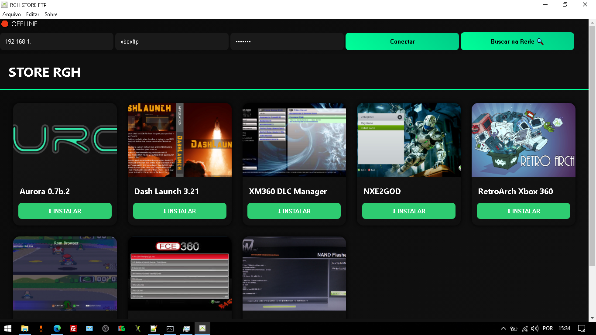

# 🚀 RGH STORE FTP

  
  
  
  

  <strong>Instalação automática de Apps e Plugins no Xbox 360 RGH/JTAG via FTP</strong> 
  Sem pendrive • Sem extração manual • Sem cliente FTP externo

---

## 🖼️ Preview

  

---

## 🔥 O que é o RGH STORE FTP?

O **RGH STORE FTP** é uma aplicação desenvolvida para automatizar completamente a instalação de aplicativos e plugins no Xbox 360 modificado (RGH/JTAG).

Ele elimina processos manuais como:

- Baixar arquivos manualmente no navegador  
- Extrair pacotes manualmente  
- Usar pendrive para transferência  
- Configurar clientes FTP externos  

Tudo acontece dentro do próprio programa.

---

## 🎯 Objetivo

Simplificar ao máximo a instalação de:

- Aurora  
- Freestyle  
- Outros homebrews compatíveis  
- Plugins do sistema  

### ⚡ Fluxo de uso

1. Informar dados FTP  
2. Escolher aplicativo ou plugin  
3. Clicar em **Instalar**  

O restante é automático.

---

## ⚙️ Funcionalidades

### 🔐 Sistema de Conexão FTP
- IP
- Usuário
- Senha
- Validação de conexão

### 💾 Conexão Automática
- Salvamento seguro dos dados  
- Reconexão rápida  
- Sem necessidade de reconfiguração  

### 🔎 Busca Automática de IP
- Detecta automaticamente o Xbox na rede local  
- Reduz erros manuais  

### 🔍 Barra de Pesquisa
- Busca rápida por Apps  
- Busca rápida por Plugins  
- Filtro instantâneo por nome

### Auto Update
- Programa Verifica se há uma atualização
- Exibe Na tela pergutando se quer ou não atualizar o programa

### 📂 Organização Automática por Tipo

O sistema identifica automaticamente o tipo do pacote:

- **Apps** → `Hdd1\Apps`  
- **Plugins** → `Hdd1\Plugins`  

Sem necessidade de mover arquivos manualmente.

---

## 📦 Instalação Inteligente Automatizada

Ao clicar em **Instalar**, o sistema executa:

1. Download do pacote  
2. Extração automática  
3. Envio via FTP  
4. Organização no diretório correto  
5. Exibição de **“Instalado com sucesso”**  

Processo 100% automatizado.

---

## 🖥️ Requisitos

- Xbox 360 com RGH ou JTAG  
- Dashboard compatível (Aurora recomendado)  
- FTP ativo no console  
- PC e Xbox na mesma rede local  
- WinRAR instalado no PC  

---

## 🛠️ Roadmap

- [ ] Interface refinada (UI moderna)  
- [ ] Sistema de atualização automática  
- [ ] Catálogo online dinâmico  
- [ ] Verificação de integridade dos arquivos  
- [ ] Modo avançado para usuários experientes  

---

## 🧠 Diferencial

✔ Instalação em poucos cliques  
✔ Processo totalmente automatizado  
✔ Redução total de etapas manuais  
✔ Simples para iniciantes  
✔ Poderoso para usuários avançados  

---

## 💰 Apoie o Projeto

Se o projeto te ajudou ou você quer apoiar o desenvolvimento:

### 🔑 Chave Pix
